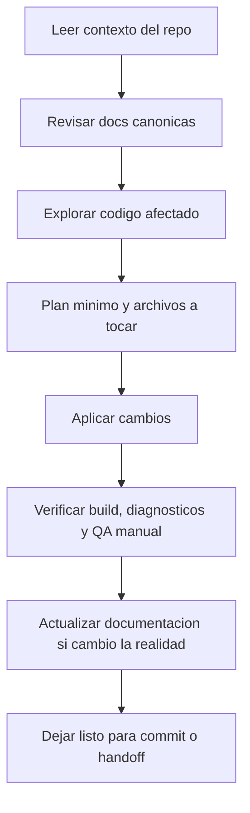

# Workflow con OpenCode / Agentes

## Objetivo

Definir una forma consistente de usar agentes en este repositorio sin desalinear código y documentación.

## Flujo recomendado



## Reglas prácticas

- Trabajar normalmente sobre `dev`.
- Usar ramas `feature/...` solo para cambios grandes, inciertos o muy mezclados.
- Si cambias comportamiento real del repo, actualizar la documentación canónica en la misma sesión.
- No describir features futuras como si ya existieran.

## Orden de lectura sugerido

1. `../README.md`
2. `../AGENTS.md`
3. `../PRE-FLIGHT.md`
4. `../ROADMAP.md`

## Comandos Básicos

### Desarrollo
```bash
npm run dev           # Iniciar servidor de desarrollo
```

### Build y Verificación
```bash
npm run build         # Build para producción
npm run preview       # Preview local
npm run check         # Verificar build y tipos
npm run verify        # Verificaciones completas
```

### Pruebas
```bash
npm run test:unit     # Pruebas unitarias
npm run test:e2e      # Pruebas E2E
```

## Proceso de Desarrollo

### 1. Lectura Inicial
- Leer `README.md` para entender la estructura
- Revisar `ROADMAP.md` para ver el estado actual
- Verificar `TASKS.md` para tareas activas

### 2. Exploración
- Usar explore agents para encontrar patrones en el código
- Leer archivos afectados antes de modificar
- Identificar dependencias y relaciones

### 3. Planificación
- Crear plan específico con archivos a modificar
- Identificar tareas paralelas
- Establecer criterios de éxito

### 4. Implementación
- Aplicar cambios paso a paso
- Ejecutar verificaciones intermedias
- Actualizar documentación si es necesario

### 5. Verificación
- Build exitoso sin errores
- Tests pasan (unitarios y E2E)
- QA manual del feature
- Revisión de regressions

### 6. Documentación
- Actualizar docs si cambia comportamiento
- Marcar tareas completadas en `TASKS.md`
- Sincronizar `PRE-FLIGHT.md` si aplica

## Commit y Push

### Mensajes de Commit
Usar [Conventional Commits](https://www.conventionalcommits.org/):

```
feat: añadir sistema de búsqueda
fix: corregir error de renderizado en mobile
docs: actualizar guía de contenido
style: ajustar espaciado en cards
refactor: optimizar carga de imágenes
test: añadir pruebas unitarias
chore: actualizar dependencias
```

### Workflow de Git
```bash
# Cambiar a la rama principal
git checkout dev

# Actualizar con los últimos cambios
git pull origin dev

# Crear rama feature
git checkout -b feature/mi-cambios

# Commit y push
git add .
git commit -m "feat: descripción del cambio"
git push origin feature/mi-cambios
```

## Verificación Final

Antes de merge:
- [ ] Build exitoso (`npm run build`)
- [ ] Tests pasan (`npm run test:all`)
- [ ] QA manual realizado
- [ ] Documentación actualizada
- [ ] No hay enlaces rotos
- [ ] Performance aceptable

## Referencias

- `PRE-FLIGHT.md` - Estado actual y decisiones pendientes
- `ROADMAP.md` - Plan de implementación
- `TASKS.md` - Tareas activas
- `ARCHITECTURE.md` - Arquitectura del proyecto
- `DECISIONS.md` - Decisiones técnicas

---
*Actualizado: 2026-03-17*
